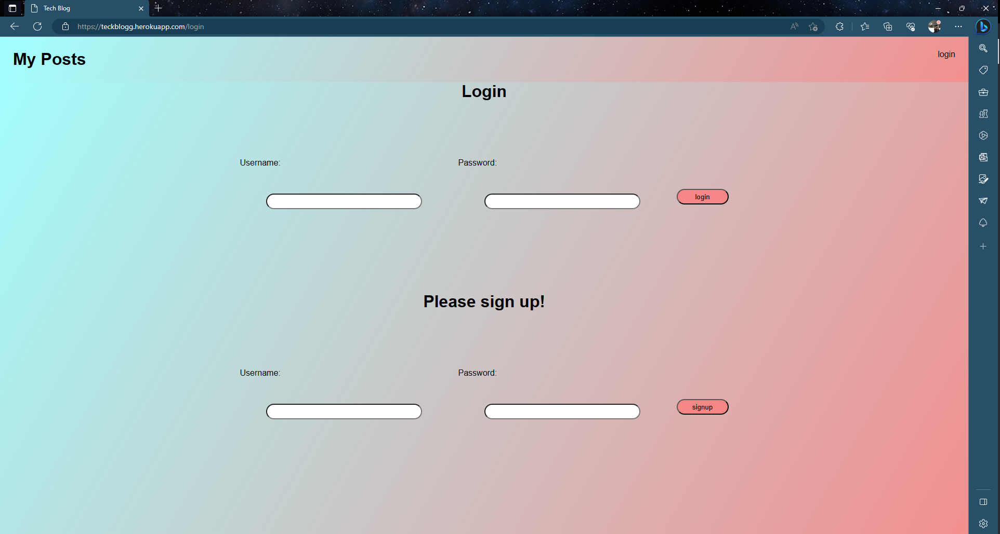
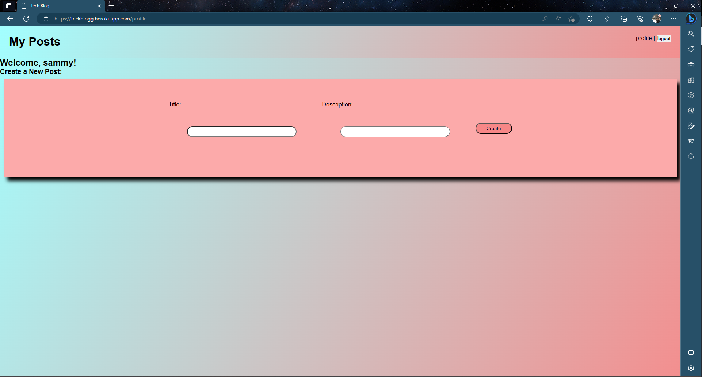

# Tech-blog
https://github.com/coltonsmith135/Tech-blog

# Description
This project is for other developers to be able to share theyre tech ideas and posts and create a positive place for developers to go to.
# Table of Contents:
* [Installation](#installation)
* [Usage](#usage)

 * [License](#License)

* [Credits](#credits)
* [Tests](#tests)

## installation

bycript, connect-session-sequelize, date-and-time, dotenv, express, express-handlebars, express-session, mysql2, sequelize

## contact info

coltonsmith135@yahoo.com

503-432-0228

## usage

it is used to create posts from developers for other people to see whether that is sharing ideas,plans, or just something fun!

## License

  MIT

## credits

Colton Smith

## tests

through localhost

https://teckblogg.herokuapp.com/

